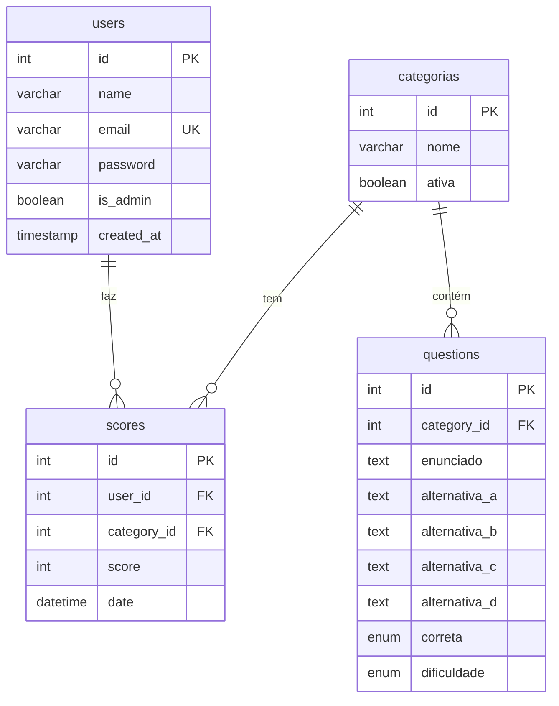

# 🗄️ Documentação Completa - Banco de Dados e Setup Local

## 📋 Índice
1. [Visão Geral](#visão-geral)
2. [Pré-requisitos](#pré-requisitos)
3. [Instalação Passo a Passo](#instalação-passo-a-passo)
4. [Estrutura do Banco de Dados](#estrutura-do-banco-de-dados)
5. [Scripts Disponíveis](#scripts-disponíveis)
6. [Configuração do Projeto](#configuração-do-projeto)
7. [Executando o Projeto](#executando-o-projeto)
8. [Troubleshooting](#troubleshooting)

---

## 🎯 Visão Geral

O **TCC Infinity** utiliza **MySQL** como banco de dados relacional para armazenar:
- 👥 Usuários e autenticação
- 📚 Categorias de quiz
- ❓ Perguntas e alternativas
- 🏆 Pontuações e ranking

### Tecnologias Utilizadas:
- **Banco de Dados:** MySQL 8.0+
- **Driver Node.js:** mysql2 (com suporte a Promises)
- **ORM:** Nenhum (SQL puro para máximo controle)
- **Pool de Conexões:** Configurado para 10 conexões simultâneas

---

## 📦 Pré-requisitos

Antes de começar, certifique-se de ter instalado:

### 1. Node.js (v18 ou superior)
```bash
# Verificar versão
node --version
```

**Download:** https://nodejs.org/

### 2. MySQL Server (v8.0 ou superior)
```bash
# Verificar versão
mysql --version
```

**Download:** https://dev.mysql.com/downloads/mysql/

### 3. Git (opcional, mas recomendado)
```bash
# Verificar versão
git --version
```

**Download:** https://git-scm.com/

---

## 🚀 Instalação Passo a Passo

### Passo 1: Clonar/Baixar o Projeto

```bash
# Se tiver Git
git clone <url-do-repositorio>
cd TCC_Infinity

# Ou baixe o ZIP e extraia
```

### Passo 2: Instalar MySQL

#### Windows:

1. **Baixar MySQL Installer:**
   - Acesse: https://dev.mysql.com/downloads/installer/
   - Baixe: `mysql-installer-community-8.x.x.msi`

2. **Executar Instalador:**
   - Escolha: **Developer Default**
   - Clique em **Next** → **Execute**

3. **Configurar MySQL Server:**
   - **Type and Networking:**
     - Config Type: `Development Computer`
     - Port: `3306` (padrão)
     - ✅ Marque: "Open Windows Firewall ports for network access"
   
   - **Authentication Method:**
     - Escolha: `Use Strong Password Encryption`
   
   - **Accounts and Roles:**
     - **Root Password:** Digite uma senha forte (ex: `Pedro12345#`)
     - ⚠️ **IMPORTANTE:** Anote essa senha!
   
   - **Windows Service:**
     - ✅ Configure MySQL Server as Windows Service
     - ✅ Start the MySQL Server at System Startup

4. **Finalizar:**
   - Clique em **Execute** → **Finish**

5. **Verificar Instalação:**
   ```cmd
   mysql --version
   ```

#### Linux (Ubuntu/Debian):

```bash
# Atualizar repositórios
sudo apt update

# Instalar MySQL Server
sudo apt install mysql-server

# Iniciar serviço
sudo systemctl start mysql
sudo systemctl enable mysql

# Configurar senha root
sudo mysql_secure_installation
```

#### macOS:

```bash
# Usando Homebrew
brew install mysql

# Iniciar serviço
brew services start mysql

# Configurar senha root
mysql_secure_installation
```

### Passo 3: Configurar Variáveis de Ambiente

1. **Navegar até a pasta backend:**
   ```bash
   cd backend
   ```

2. **Verificar arquivo `.env`:**
   
   O arquivo já existe em `backend/.env` com o seguinte conteúdo:
   
   ```env
   DB_HOST=localhost
   DB_USER=root
   DB_PASS="Pedro12345#"
   DB_NAME=infinity_quiz
   PORT=3000
   ```

3. **Ajustar se necessário:**
   
   Se você usou uma senha diferente no MySQL, edite o arquivo `.env`:
   
   ```env
   DB_PASS="SUA_SENHA_AQUI"
   ```

### Passo 4: Instalar Dependências

#### Backend:

```bash
# Na pasta backend
cd backend
npm install
```

**Dependências instaladas:**
- `express` - Framework web
- `mysql2` - Driver MySQL
- `bcrypt` - Hash de senhas
- `jsonwebtoken` - Autenticação JWT
- `cors` - Habilitar CORS
- `dotenv` - Variáveis de ambiente

#### Frontend:

```bash
# Na pasta frontend
cd ../frontend
npm install
```

**Dependências instaladas:**
- `react` - Biblioteca UI
- `react-router-dom` - Roteamento
- `axios` - Cliente HTTP
- `lucide-react` - Ícones
- `vite` - Build tool

### Passo 5: Criar e Popular o Banco de Dados

```bash
# Voltar para a pasta backend
cd ../backend

# Executar script de setup
node setup_db.js
```

**O que esse script faz:**
1. ✅ Cria o banco `infinity_quiz`
2. ✅ Cria 4 tabelas (users, categorias, questions, scores)
3. ✅ Insere 3 categorias padrão
4. ✅ Insere 100+ perguntas de exemplo

**Saída esperada:**
```
🔄 Iniciando configuração do banco de dados...
📂 Lendo arquivos SQL...
🛠️  Criando tabelas...
✅ Tabelas criadas com sucesso!
🌱 Populando banco com perguntas...
✅ Perguntas inseridas com sucesso!
🎉 Banco de dados configurado e pronto para uso!
```

### Passo 6: Criar Usuário Administrador

```bash
# Ainda na pasta backend
node create_admin.js
```

**Saída esperada:**
```
✅ Usuário administrador criado com sucesso!

📋 Credenciais do Admin:
   Email: admin123@gmail.com
   Senha: admin123

🔗 Após login, acesse /admin para gerenciar perguntas.
```

### Passo 7: Iniciar os Servidores

#### Terminal 1 - Backend:

```bash
cd backend
node server.js
```

**Saída esperada:**
```
Servidor rodando na porta 3000
```

#### Terminal 2 - Frontend:

```bash
cd frontend
npm run dev
```

**Saída esperada:**
```
  VITE v5.x.x  ready in xxx ms

  ➜  Local:   http://localhost:5173/
  ➜  Network: use --host to expose
```

### Passo 8: Acessar a Aplicação

1. **Abrir navegador:**
   - URL: http://localhost:5173

2. **Fazer login como admin:**
   - Email: `admin123@gmail.com`
   - Senha: `admin123`

3. **Testar funcionalidades:**
   - ✅ Fazer quiz
   - ✅ Ver ranking
   - ✅ Acessar painel admin (/admin)
   - ✅ Gerenciar perguntas

---

## 🗂️ Estrutura do Banco de Dados

### Diagrama ER (Entidade-Relacionamento)



### Tabelas Detalhadas

#### 1. Tabela `users`

Armazena informações dos usuários e administradores.

| Coluna | Tipo | Descrição | Constraints |
|--------|------|-----------|-------------|
| `id` | INT | Identificador único | PRIMARY KEY, AUTO_INCREMENT |
| `name` | VARCHAR(255) | Nome completo | NOT NULL |
| `email` | VARCHAR(255) | Email do usuário | NOT NULL, UNIQUE |
| `password` | VARCHAR(255) | Senha hash (bcrypt) | NOT NULL |
| `is_admin` | BOOLEAN | Flag de administrador | DEFAULT FALSE |
| `created_at` | TIMESTAMP | Data de criação | DEFAULT CURRENT_TIMESTAMP |

**Índices:**
- PRIMARY KEY: `id`
- UNIQUE: `email`

**Exemplo de dados:**
```sql
INSERT INTO users (name, email, password, is_admin) VALUES
('João Silva', 'joao@email.com', '$2b$10$...', FALSE),
('Admin', 'admin123@gmail.com', '$2b$10$...', TRUE);
```

#### 2. Tabela `categorias`

Define as categorias de quiz disponíveis.

| Coluna | Tipo | Descrição | Constraints |
|--------|------|-----------|-------------|
| `id` | INT | Identificador único | PRIMARY KEY, AUTO_INCREMENT |
| `nome` | VARCHAR(255) | Nome da categoria | NOT NULL |
| `ativa` | BOOLEAN | Se está ativa | DEFAULT TRUE |

**Categorias padrão:**
1. Tecnologia
2. Ciências
3. História

**Exemplo de dados:**
```sql
INSERT INTO categorias (id, nome) VALUES
(1, 'Tecnologia'),
(2, 'Ciências'),
(3, 'História');
```

#### 3. Tabela `questions`

Armazena todas as perguntas do quiz.

| Coluna | Tipo | Descrição | Constraints |
|--------|------|-----------|-------------|
| `id` | INT | Identificador único | PRIMARY KEY, AUTO_INCREMENT |
| `category_id` | INT | ID da categoria | NOT NULL, FOREIGN KEY |
| `enunciado` | TEXT | Texto da pergunta | NOT NULL |
| `alternativa_a` | TEXT | Primeira alternativa | NOT NULL |
| `alternativa_b` | TEXT | Segunda alternativa | NOT NULL |
| `alternativa_c` | TEXT | Terceira alternativa | NOT NULL |
| `alternativa_d` | TEXT | Quarta alternativa | NOT NULL |
| `correta` | ENUM | Alternativa correta | NOT NULL |
| `dificuldade` | ENUM | Nível de dificuldade | DEFAULT 'medio' |

**Valores ENUM:**
- `correta`: 'alternativa_a', 'alternativa_b', 'alternativa_c', 'alternativa_d'
- `dificuldade`: 'facil', 'medio', 'dificil'

**Relacionamentos:**
- `category_id` → `categorias(id)`

**Exemplo de dados:**
```sql
INSERT INTO questions (category_id, enunciado, dificuldade, 
    alternativa_a, alternativa_b, alternativa_c, alternativa_d, correta) 
VALUES
(1, 'Qual linguagem é conhecida como a "linguagem da web"?', 'facil',
    'Python', 'JavaScript', 'Java', 'C++', 'alternativa_b');
```

**Estatísticas:**
- Total: 100+ perguntas
- Tecnologia: ~40 perguntas
- Ciências: ~40 perguntas
- História: ~40 perguntas
- Distribuição: ~12 fáceis, ~12 médias, ~12 difíceis por categoria

#### 4. Tabela `scores`

Registra as pontuações dos usuários.

| Coluna | Tipo | Descrição | Constraints |
|--------|------|-----------|-------------|
| `id` | INT | Identificador único | PRIMARY KEY, AUTO_INCREMENT |
| `user_id` | INT | ID do usuário | NOT NULL, FOREIGN KEY |
| `category_id` | INT | ID da categoria | NOT NULL, FOREIGN KEY |
| `score` | INT | Pontuação obtida | NOT NULL |
| `date` | DATETIME | Data/hora do quiz | DEFAULT CURRENT_TIMESTAMP |

**Relacionamentos:**
- `user_id` → `users(id)`
- `category_id` → `categorias(id)`

**Exemplo de dados:**
```sql
INSERT INTO scores (user_id, category_id, score) VALUES
(1, 1, 85),
(1, 2, 92),
(2, 1, 78);
```

---

## 📜 Scripts Disponíveis

### Backend Scripts

#### 1. `setup_db.js` - Setup Completo do Banco

**Localização:** [backend/setup_db.js](file:///c:/Users/pedro/Desktop/TCC_Infinity/backend/setup_db.js)

**Função:** Cria e popula o banco de dados completo.

**Uso:**
```bash
cd backend
node setup_db.js
```

**O que faz:**
1. Conecta ao MySQL sem selecionar banco
2. Executa `schema.sql` (cria tabelas)
3. Executa `sample_questions.sql` (insere perguntas)
4. Fecha conexão

**Quando usar:**
- ✅ Primeira instalação
- ✅ Reset completo do banco
- ✅ Após mudanças no schema

**Código explicado:**
```javascript
const connection = await mysql.createConnection({
    host: process.env.DB_HOST,
    user: process.env.DB_USER,
    password: process.env.DB_PASS,
    multipleStatements: true  // Permite múltiplos comandos SQL
});

// Lê arquivos SQL
const schema = fs.readFileSync('schema.sql', 'utf8');
const questions = fs.readFileSync('sample_questions.sql', 'utf8');

// Executa SQL
await connection.query(schema);
await connection.query(questions);
```

#### 2. `create_admin.js` - Criar Usuário Admin

**Localização:** [backend/create_admin.js](file:///c:/Users/pedro/Desktop/TCC_Infinity/backend/create_admin.js)

**Função:** Cria ou atualiza usuário administrador.

**Uso:**
```bash
cd backend
node create_admin.js
```

**O que faz:**
1. Verifica se coluna `is_admin` existe
2. Adiciona coluna se não existir
3. Verifica se admin já existe
4. Cria novo admin ou atualiza existente
5. Exibe credenciais

**Credenciais padrão:**
- Email: `admin123@gmail.com`
- Senha: `admin123`

**Quando usar:**
- ✅ Após setup inicial
- ✅ Se esqueceu senha do admin
- ✅ Para criar admin adicional

**Segurança:**
```javascript
// Senha é hasheada com bcrypt (10 rounds)
const hashedPassword = await bcrypt.hash('admin123', 10);
```

#### 3. `server.js` - Servidor Backend

**Localização:** [backend/server.js](file:///c:/Users/pedro/Desktop/TCC_Infinity/backend/server.js)

**Função:** Inicia o servidor Express.

**Uso:**
```bash
cd backend
node server.js
```

**Porta:** 3000 (configurável via `.env`)

**Endpoints disponíveis:**
- `POST /api/auth/register` - Registro
- `POST /api/auth/login` - Login
- `GET /api/categories` - Listar categorias
- `GET /api/questions/:categoryId` - Perguntas por categoria
- `POST /api/scores` - Salvar pontuação
- `GET /api/ranking` - Ranking geral
- `GET /api/admin/questions` - Listar perguntas (admin)
- `POST /api/admin/questions` - Criar pergunta (admin)
- `PUT /api/admin/questions/:id` - Editar pergunta (admin)
- `DELETE /api/admin/questions/:id` - Deletar pergunta (admin)

### Frontend Scripts

#### 1. `npm run dev` - Servidor de Desenvolvimento

**Uso:**
```bash
cd frontend
npm run dev
```

**Características:**
- ⚡ Hot Module Replacement (HMR)
- 🔄 Recarregamento automático
- 🐛 Source maps para debug
- 🚀 Porta: 5173

#### 2. `npm run build` - Build de Produção

**Uso:**
```bash
cd frontend
npm run build
```

**Saída:** `frontend/dist/`

**Otimizações:**
- Minificação de JS/CSS
- Tree-shaking
- Code splitting
- Asset optimization

#### 3. `npm run preview` - Preview de Produção

**Uso:**
```bash
cd frontend
npm run build
npm run preview
```

**Função:** Testa o build de produção localmente.

#### 4. `node generate-icons.js` - Gerar Ícones PWA

**Uso:**
```bash
cd frontend
node generate-icons.js
```

**Função:** Gera ícones PWA em 8 tamanhos.

---

## ⚙️ Configuração do Projeto

### Arquivo `.env` (Backend)

**Localização:** [backend/.env](file:///c:/Users/pedro/Desktop/TCC_Infinity/backend/.env)

```env
# Configuração do MySQL
DB_HOST=localhost          # Host do banco
DB_USER=root              # Usuário do MySQL
DB_PASS="Pedro12345#"     # Senha do MySQL
DB_NAME=infinity_quiz     # Nome do banco

# Porta do servidor
PORT=3000                 # Porta do backend
```

**Variáveis:**

| Variável | Descrição | Padrão |
|----------|-----------|--------|
| `DB_HOST` | Endereço do MySQL | localhost |
| `DB_USER` | Usuário do banco | root |
| `DB_PASS` | Senha do banco | (sua senha) |
| `DB_NAME` | Nome do banco | infinity_quiz |
| `PORT` | Porta do servidor | 3000 |

**⚠️ Segurança:**
- Nunca commite o `.env` no Git
- Use senhas fortes
- Em produção, use variáveis de ambiente do servidor

### Arquivo `db.js` (Conexão)

**Localização:** [backend/db.js](file:///c:/Users/pedro/Desktop/TCC_Infinity/backend/db.js)

```javascript
const pool = mysql.createPool({
    host: process.env.DB_HOST,
    user: process.env.DB_USER,
    password: process.env.DB_PASS,
    database: process.env.DB_NAME,
    waitForConnections: true,    // Aguarda conexão disponível
    connectionLimit: 10,          // Máximo de 10 conexões
    queueLimit: 0                 // Sem limite de fila
});

const db = pool.promise();  // Usa Promises em vez de callbacks
```

**Pool de Conexões:**
- Reutiliza conexões
- Melhor performance
- Gerenciamento automático

**Uso em controllers:**
```javascript
const db = require('../db');

// Executar query
const [rows] = await db.query('SELECT * FROM users WHERE id = ?', [userId]);
```

---

## 🎮 Executando o Projeto

### Modo Desenvolvimento (Recomendado)

#### Opção 1: Dois Terminais

**Terminal 1 - Backend:**
```bash
cd backend
node server.js
```

**Terminal 2 - Frontend:**
```bash
cd frontend
npm run dev
```

#### Opção 2: Script Único (Windows)

Crie `start.bat` na raiz:
```batch
@echo off
start cmd /k "cd backend && node server.js"
start cmd /k "cd frontend && npm run dev"
```

Execute:
```bash
start.bat
```

#### Opção 3: Script Único (Linux/Mac)

Crie `start.sh` na raiz:
```bash
#!/bin/bash
cd backend && node server.js &
cd frontend && npm run dev
```

Execute:
```bash
chmod +x start.sh
./start.sh
```

### Acessar Aplicação

1. **Frontend:** http://localhost:5173
2. **Backend API:** http://localhost:3000
3. **Painel Admin:** http://localhost:5173/admin

### Fluxo de Teste Completo

1. **Registrar novo usuário:**
   - Ir para `/register`
   - Preencher formulário
   - Criar conta

2. **Fazer login:**
   - Email e senha
   - Redireciona para home

3. **Fazer quiz:**
   - Escolher categoria
   - Responder 10 perguntas
   - Ver resultado

4. **Ver ranking:**
   - Ir para `/ranking`
   - Ver top usuários

5. **Login como admin:**
   - Email: `admin123@gmail.com`
   - Senha: `admin123`
   - Ir para `/admin`

6. **Gerenciar perguntas:**
   - Adicionar nova pergunta
   - Editar pergunta existente
   - Deletar pergunta

---

## 🔧 Troubleshooting

### Problema 1: Erro ao conectar ao MySQL

**Erro:**
```
Error: connect ECONNREFUSED 127.0.0.1:3306
```

**Causas possíveis:**

1. **MySQL não está rodando**
   ```bash
   # Windows
   net start MySQL80
   
   # Linux
   sudo systemctl start mysql
   
   # Mac
   brew services start mysql
   ```

2. **Porta incorreta**
   - Verificar porta no MySQL Workbench
   - Atualizar `DB_HOST` no `.env`

3. **Firewall bloqueando**
   - Adicionar exceção para porta 3306

**Solução:**
```bash
# Verificar se MySQL está rodando
mysql -u root -p

# Se conectar, o MySQL está OK
# Se não, reiniciar serviço
```

### Problema 2: Senha do MySQL incorreta

**Erro:**
```
Error: Access denied for user 'root'@'localhost'
```

**Solução:**

1. **Resetar senha do root:**
   ```bash
   # Windows
   mysqladmin -u root password "NovaSenha"
   
   # Linux
   sudo mysql
   ALTER USER 'root'@'localhost' IDENTIFIED BY 'NovaSenha';
   FLUSH PRIVILEGES;
   ```

2. **Atualizar `.env`:**
   ```env
   DB_PASS="NovaSenha"
   ```

### Problema 3: Banco de dados não existe

**Erro:**
```
Error: Unknown database 'infinity_quiz'
```

**Solução:**
```bash
# Executar script de setup
cd backend
node setup_db.js
```

### Problema 4: Tabelas não existem

**Erro:**
```
Error: Table 'infinity_quiz.users' doesn't exist
```

**Solução:**
```bash
# Re-executar setup
cd backend
node setup_db.js
```

### Problema 5: Porta 3000 já em uso

**Erro:**
```
Error: listen EADDRINUSE: address already in use :::3000
```

**Solução:**

**Opção 1 - Matar processo:**
```bash
# Windows
netstat -ano | findstr :3000
taskkill /PID <PID> /F

# Linux/Mac
lsof -i :3000
kill -9 <PID>
```

**Opção 2 - Mudar porta:**
```env
# .env
PORT=3001
```

### Problema 6: CORS Error

**Erro:**
```
Access to XMLHttpRequest blocked by CORS policy
```

**Causa:** Frontend e backend em portas diferentes.

**Solução:** Já configurado no `server.js`:
```javascript
app.use(cors({
    origin: 'http://localhost:5173'
}));
```

Se mudou a porta do frontend, atualizar no backend.

### Problema 7: npm install falha

**Erro:**
```
npm ERR! code ENOENT
```

**Solução:**
```bash
# Limpar cache
npm cache clean --force

# Deletar node_modules e package-lock.json
rm -rf node_modules package-lock.json

# Reinstalar
npm install
```

### Problema 8: Vite não inicia

**Erro:**
```
Error: Cannot find module 'vite'
```

**Solução:**
```bash
cd frontend
npm install vite --save-dev
npm run dev
```

### Problema 9: Service Worker não registra

**Causa:** Precisa de HTTPS ou localhost.

**Solução:** 
- Desenvolvimento: usar `localhost` (já funciona)
- Produção: configurar HTTPS

### Problema 10: Admin não consegue acessar /admin

**Causa:** Usuário não é admin.

**Solução:**
```bash
# Executar script de admin
cd backend
node create_admin.js

# Ou atualizar manualmente
mysql -u root -p
USE infinity_quiz;
UPDATE users SET is_admin = TRUE WHERE email = 'seu@email.com';
```

---

## 📊 Comandos Úteis MySQL

### Acessar MySQL via terminal:

```bash
mysql -u root -p
```

### Comandos básicos:

```sql
-- Listar bancos
SHOW DATABASES;

-- Usar banco
USE infinity_quiz;

-- Listar tabelas
SHOW TABLES;

-- Ver estrutura de tabela
DESCRIBE users;

-- Contar registros
SELECT COUNT(*) FROM questions;

-- Ver últimos usuários
SELECT * FROM users ORDER BY created_at DESC LIMIT 5;

-- Ver ranking
SELECT u.name, s.score, c.nome as categoria
FROM scores s
JOIN users u ON s.user_id = u.id
JOIN categorias c ON s.category_id = c.id
ORDER BY s.score DESC
LIMIT 10;

-- Deletar todos os scores
DELETE FROM scores;

-- Resetar auto_increment
ALTER TABLE scores AUTO_INCREMENT = 1;

-- Backup de tabela
CREATE TABLE users_backup AS SELECT * FROM users;

-- Sair
EXIT;
```

---

## 🎓 Resumo dos Comandos

### Setup Inicial (Execute uma vez):

```bash
# 1. Instalar dependências
cd backend && npm install
cd ../frontend && npm install

# 2. Configurar banco
cd ../backend
node setup_db.js

# 3. Criar admin
node create_admin.js
```

### Uso Diário:

```bash
# Terminal 1 - Backend
cd backend
node server.js

# Terminal 2 - Frontend
cd frontend
npm run dev
```

### Reset Completo:

```bash
# 1. Dropar banco
mysql -u root -p
DROP DATABASE infinity_quiz;
EXIT;

# 2. Recriar tudo
cd backend
node setup_db.js
node create_admin.js
```

---

## 📚 Recursos Adicionais

### Documentação Oficial:
- [MySQL Documentation](https://dev.mysql.com/doc/)
- [Node.js MySQL2](https://github.com/sidorares/node-mysql2)
- [Express.js](https://expressjs.com/)
- [React](https://react.dev/)
- [Vite](https://vitejs.dev/)

### Ferramentas Recomendadas:
- **MySQL Workbench** - GUI para MySQL
- **Postman** - Testar APIs
- **VS Code** - Editor de código
- **Chrome DevTools** - Debug frontend

---

## ✅ Checklist de Instalação

Use este checklist para garantir que tudo está funcionando:

### Pré-requisitos
- [ ] Node.js instalado (v18+)
- [ ] MySQL instalado (v8.0+)
- [ ] Git instalado (opcional)

### Instalação
- [ ] Projeto clonado/baixado
- [ ] Dependências backend instaladas
- [ ] Dependências frontend instaladas
- [ ] Arquivo `.env` configurado
- [ ] Senha MySQL correta no `.env`

### Banco de Dados
- [ ] MySQL rodando
- [ ] Script `setup_db.js` executado
- [ ] Banco `infinity_quiz` criado
- [ ] 4 tabelas criadas
- [ ] 100+ perguntas inseridas
- [ ] Script `create_admin.js` executado
- [ ] Admin criado com sucesso

### Servidores
- [ ] Backend rodando (porta 3000)
- [ ] Frontend rodando (porta 5173)
- [ ] Sem erros no console

### Funcionalidades
- [ ] Página inicial carrega
- [ ] Registro funciona
- [ ] Login funciona
- [ ] Quiz funciona
- [ ] Ranking funciona
- [ ] Login admin funciona
- [ ] Painel admin acessível
- [ ] CRUD de perguntas funciona

---

## 🎉 Conclusão

Seguindo este guia, você terá o **TCC Infinity** rodando localmente com:

1. ✅ **MySQL configurado** com 4 tabelas
2. ✅ **100+ perguntas** em 3 categorias
3. ✅ **Usuário admin** criado
4. ✅ **Backend** rodando na porta 3000
5. ✅ **Frontend** rodando na porta 5173
6. ✅ **PWA** instalável e offline

O projeto está pronto para desenvolvimento e testes! 🚀

---

**Desenvolvido para TCC Infinity**  
*Última atualização: 28/01/2026*
