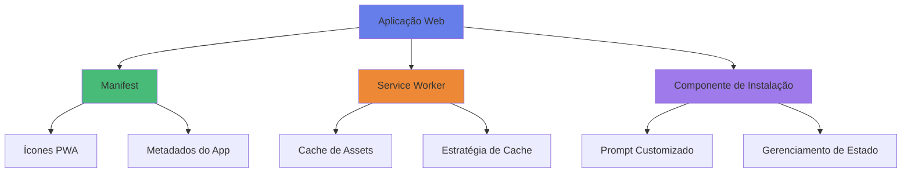
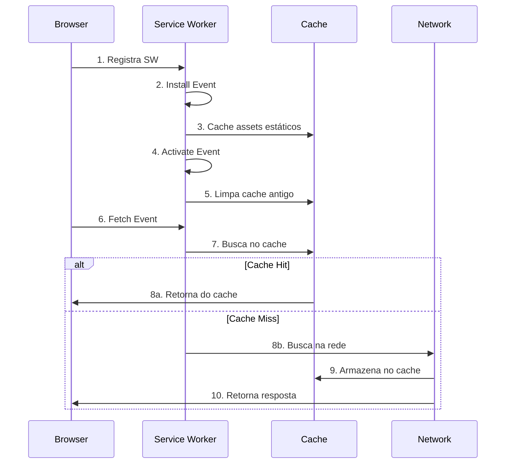
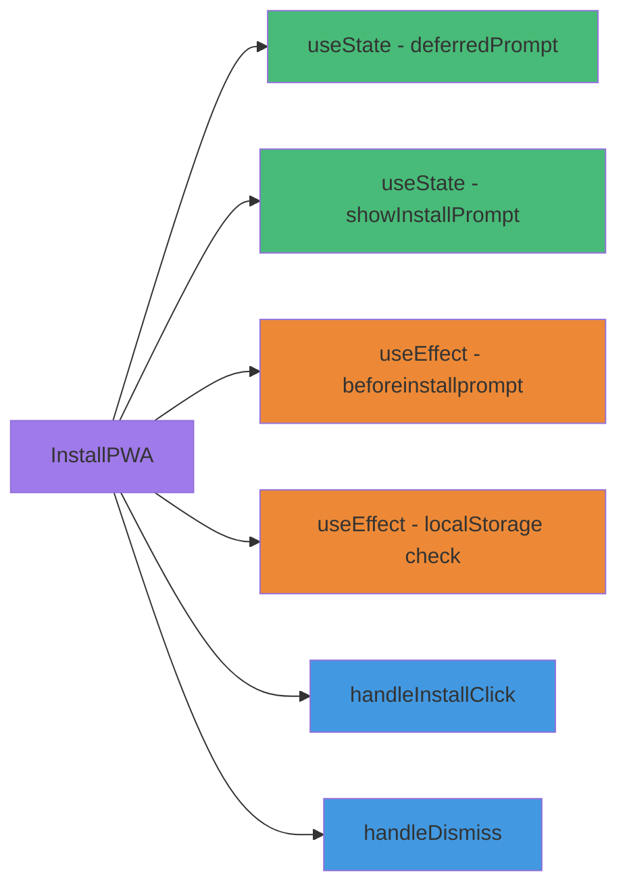
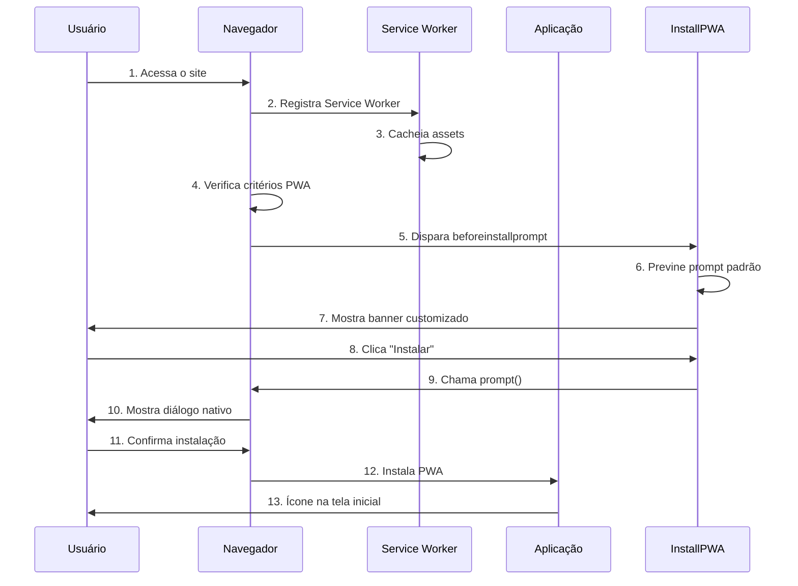
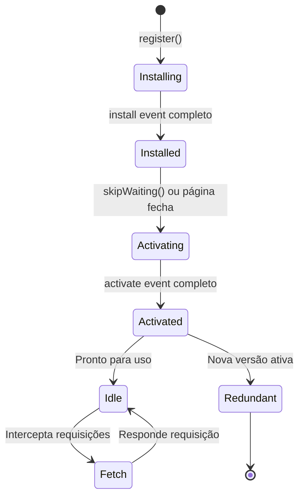

# 📱 Documentação Completa - Progressive Web App (PWA)

## 📋 Índice
1. [O que é um PWA?](#o-que-é-um-pwa)
2. [Arquitetura da Implementação](#arquitetura-da-implementação)
3. [Componentes Implementados](#componentes-implementados)
4. [Processo de Desenvolvimento](#processo-de-desenvolvimento)
5. [Como Funciona](#como-funciona)
6. [Guia de Testes](#guia-de-testes)
7. [Troubleshooting](#troubleshooting)

---

## 🎯 O que é um PWA?

Um **Progressive Web App (PWA)** é uma aplicação web que utiliza tecnologias modernas para proporcionar uma experiência similar a aplicativos nativos. Os principais benefícios incluem:

### Características Principais:
- ✅ **Instalável** - Pode ser instalado na tela inicial do dispositivo
- ✅ **Offline** - Funciona sem conexão à internet (cache)
- ✅ **Rápido** - Carregamento instantâneo com cache inteligente
- ✅ **Responsivo** - Adapta-se a qualquer tamanho de tela
- ✅ **Seguro** - Requer HTTPS
- ✅ **Engajamento** - Notificações push (opcional)

### Por que implementar um PWA?

1. **Melhor experiência do usuário** - Acesso rápido sem precisar abrir o navegador
2. **Funcionalidade offline** - Usuários podem acessar conteúdo mesmo sem internet
3. **Menor uso de dados** - Cache reduz downloads repetidos
4. **Maior engajamento** - Ícone na tela inicial aumenta retorno de usuários
5. **Sem necessidade de lojas de apps** - Instalação direta pelo navegador

---

## 🏗️ Arquitetura da Implementação

A implementação do PWA no **TCC Infinity** segue a arquitetura padrão de PWAs, composta por três pilares fundamentais:



### Estrutura de Arquivos:

```
frontend/
├── public/
│   ├── manifest.webmanifest      # Configuração do PWA
│   ├── sw.js                      # Service Worker
│   ├── icons/                     # Ícones em vários tamanhos
│   │   ├── icon-72x72.png
│   │   ├── icon-96x96.png
│   │   ├── icon-128x128.png
│   │   ├── icon-144x144.png
│   │   ├── icon-152x152.png
│   │   ├── icon-192x192.png
│   │   ├── icon-384x384.png
│   │   └── icon-512x512.png
│   └── index.html                 # Meta tags PWA
├── src/
│   ├── components/
│   │   └── InstallPWA.jsx        # Componente de instalação
│   ├── styles/
│   │   └── InstallPWA.css        # Estilos do banner
│   └── App.jsx                    # Integração do componente
└── generate-icons.js              # Script para gerar ícones
```

---

## 🧩 Componentes Implementados

### 1. Manifest (manifest.webmanifest)

O **Web App Manifest** é um arquivo JSON que define como o PWA deve se comportar quando instalado.

#### Localização:
[frontend/public/manifest.webmanifest](file:///c:/Users/pedro/Desktop/TCC_Infinity/frontend/public/manifest.webmanifest)

#### Configurações Principais:

```json
{
  "name": "TCC Infinity",
  "short_name": "TCC Infinity",
  "description": "Aplicativo de quiz educacional",
  "start_url": "/",
  "display": "standalone",
  "background_color": "#1a1a2e",
  "theme_color": "#6366f1",
  "orientation": "portrait-primary",
  "icons": [...]
}
```

#### Explicação dos Campos:

| Campo | Descrição | Valor |
|-------|-----------|-------|
| `name` | Nome completo do app | "TCC Infinity" |
| `short_name` | Nome curto (tela inicial) | "TCC Infinity" |
| `description` | Descrição do app | "Aplicativo de quiz educacional" |
| `start_url` | URL inicial ao abrir | "/" |
| `display` | Modo de exibição | "standalone" (sem barra do navegador) |
| `background_color` | Cor de fundo do splash screen | "#1a1a2e" (azul escuro) |
| `theme_color` | Cor da barra de status | "#6366f1" (roxo) |
| `orientation` | Orientação preferida | "portrait-primary" (vertical) |
| `icons` | Array de ícones | Vários tamanhos |

#### Ícones Configurados:

O manifest inclui ícones em **8 tamanhos diferentes** para garantir compatibilidade com todos os dispositivos:

- **72x72** - Dispositivos Android antigos
- **96x96** - Dispositivos Android
- **128x128** - Chrome Web Store
- **144x144** - Windows 8/10
- **152x152** - iPad
- **192x192** - Android (padrão)
- **384x384** - Android (alta resolução)
- **512x512** - Splash screens e PWA Store

---

### 2. Service Worker (sw.js)

O **Service Worker** é um script JavaScript que roda em segundo plano, separado da página web, permitindo funcionalidades como cache offline.

#### Localização:
[frontend/public/sw.js](file:///c:/Users/pedro/Desktop/TCC_Infinity/frontend/public/sw.js)

#### Ciclo de Vida do Service Worker:



#### Código Explicado:

##### 1. Definição do Cache

```javascript
const CACHE_NAME = 'tcc-infinity-v1';
const urlsToCache = [
  '/',
  '/index.html',
  '/manifest.webmanifest',
  '/src/main.jsx',
  '/src/index.css'
];
```

- `CACHE_NAME`: Nome da versão do cache (incrementar ao atualizar)
- `urlsToCache`: Lista de arquivos essenciais para funcionar offline

##### 2. Evento Install

```javascript
self.addEventListener('install', (event) => {
  event.waitUntil(
    caches.open(CACHE_NAME)
      .then((cache) => {
        console.log('Cache aberto');
        return cache.addAll(urlsToCache);
      })
  );
});
```

**O que acontece:**
1. Service Worker é instalado
2. Abre o cache com o nome definido
3. Adiciona todos os arquivos da lista ao cache
4. Aguarda conclusão antes de prosseguir

##### 3. Evento Activate

```javascript
self.addEventListener('activate', (event) => {
  event.waitUntil(
    caches.keys().then((cacheNames) => {
      return Promise.all(
        cacheNames.map((cacheName) => {
          if (cacheName !== CACHE_NAME) {
            console.log('Removendo cache antigo:', cacheName);
            return caches.delete(cacheName);
          }
        })
      );
    })
  );
});
```

**O que acontece:**
1. Service Worker é ativado
2. Lista todos os caches existentes
3. Remove caches antigos (versões anteriores)
4. Mantém apenas o cache atual

##### 4. Evento Fetch (Estratégia Cache-First)

```javascript
self.addEventListener('fetch', (event) => {
  event.respondWith(
    caches.match(event.request)
      .then((response) => {
        // Cache hit - retorna resposta do cache
        if (response) {
          return response;
        }
        
        // Cache miss - busca na rede
        return fetch(event.request).then((response) => {
          // Não cacheia se não for uma resposta válida
          if (!response || response.status !== 200 || response.type !== 'basic') {
            return response;
          }
          
          // Clona a resposta
          const responseToCache = response.clone();
          
          // Adiciona ao cache
          caches.open(CACHE_NAME).then((cache) => {
            cache.put(event.request, responseToCache);
          });
          
          return response;
        });
      })
  );
});
```

**Estratégia Cache-First:**
1. Intercepta todas as requisições de rede
2. Verifica se existe no cache
3. Se existe → retorna do cache (rápido!)
4. Se não existe → busca na rede
5. Armazena a resposta no cache para próxima vez
6. Retorna a resposta ao navegador

**Vantagens:**
- ⚡ Carregamento instantâneo de recursos em cache
- 📱 Funciona offline
- 💾 Reduz uso de dados

---

### 3. Componente InstallPWA

O componente React que gerencia o prompt de instalação do PWA.

#### Localização:
[frontend/src/components/InstallPWA.jsx](file:///c:/Users/pedro/Desktop/TCC_Infinity/frontend/src/components/InstallPWA.jsx)

#### Estrutura do Componente:



#### Código Explicado por Seção:

##### 1. Estados do Componente

```javascript
const [deferredPrompt, setDeferredPrompt] = useState(null);
const [showInstallPrompt, setShowInstallPrompt] = useState(false);
```

**Estados:**
- `deferredPrompt`: Armazena o evento de instalação do navegador
- `showInstallPrompt`: Controla visibilidade do banner

##### 2. Captura do Evento beforeinstallprompt

```javascript
useEffect(() => {
    const handler = (e) => {
        // Previne o prompt automático do navegador
        e.preventDefault();
        // Salva o evento para usar depois
        setDeferredPrompt(e);
        // Mostra o prompt customizado
        setShowInstallPrompt(true);
    };

    window.addEventListener('beforeinstallprompt', handler);

    return () => window.removeEventListener('beforeinstallprompt', handler);
}, []);
```

**O que acontece:**
1. Navegador detecta que o site é instalável
2. Dispara evento `beforeinstallprompt`
3. Prevenimos o prompt padrão do navegador
4. Salvamos o evento para usar depois
5. Mostramos nosso banner customizado

##### 3. Função de Instalação

```javascript
const handleInstallClick = async () => {
    if (!deferredPrompt) return;

    // Mostra o prompt de instalação
    deferredPrompt.prompt();

    // Aguarda a escolha do usuário
    const { outcome } = await deferredPrompt.userChoice;

    console.log(`User response: ${outcome}`);

    // Limpa o prompt
    setDeferredPrompt(null);
    setShowInstallPrompt(false);
};
```

**Fluxo:**
1. Usuário clica em "Instalar"
2. Mostra o prompt nativo do navegador
3. Aguarda decisão do usuário (aceitar/recusar)
4. Registra a escolha no console
5. Esconde o banner

##### 4. Função de Dispensar

```javascript
const handleDismiss = () => {
    setShowInstallPrompt(false);
    // Salva no localStorage para não mostrar novamente
    localStorage.setItem('pwa-install-dismissed', 'true');
};
```

**Comportamento:**
- Esconde o banner
- Salva preferência no localStorage
- Não mostra novamente nesta sessão

##### 5. Verificação de Preferência Salva

```javascript
useEffect(() => {
    const dismissed = localStorage.getItem('pwa-install-dismissed');
    if (dismissed === 'true') {
        setShowInstallPrompt(false);
    }
}, []);
```

**Respeita a escolha do usuário:**
- Verifica se usuário já dispensou antes
- Se sim, não mostra o banner

##### 6. Renderização Condicional

```javascript
if (!showInstallPrompt) return null;

return (
    <div className="install-pwa-banner">
        {/* Banner UI */}
    </div>
);
```

**Renderiza apenas se:**
- `showInstallPrompt` for `true`
- Usuário não dispensou antes
- Navegador disparou o evento

---

### 4. Estilos do Banner (InstallPWA.css)

#### Localização:
[frontend/src/styles/InstallPWA.css](file:///c:/Users/pedro/Desktop/TCC_Infinity/frontend/src/styles/InstallPWA.css)

#### Design Explicado:

##### Posicionamento e Animação de Entrada

```css
.install-pwa-banner {
    position: fixed;
    bottom: 20px;
    left: 50%;
    transform: translateX(-50%);
    z-index: 1000;
    animation: slideUp 0.3s ease-out;
}

@keyframes slideUp {
    from {
        transform: translateX(-50%) translateY(100px);
        opacity: 0;
    }
    to {
        transform: translateX(-50%) translateY(0);
        opacity: 1;
    }
}
```

**Características:**
- Fixo na parte inferior central da tela
- Animação suave de entrada (desliza de baixo para cima)
- Z-index alto para ficar sobre outros elementos

##### Gradiente e Glassmorphism

```css
.install-pwa-content {
    background: linear-gradient(135deg, #667eea 0%, #764ba2 100%);
    color: white;
    padding: 16px 24px;
    border-radius: 16px;
    box-shadow: 0 8px 32px rgba(0, 0, 0, 0.3);
    backdrop-filter: blur(10px);
}
```

**Efeitos visuais:**
- Gradiente roxo moderno
- Bordas arredondadas
- Sombra profunda para destaque
- Efeito de vidro (glassmorphism)

##### Animação do Ícone

```css
.install-icon {
    animation: bounce 2s infinite;
}

@keyframes bounce {
    0%, 100% { transform: translateY(0); }
    50% { transform: translateY(-5px); }
}
```

**Micro-interação:**
- Ícone de download "pulsa" sutilmente
- Chama atenção do usuário
- Loop infinito

##### Responsividade

```css
@media (max-width: 600px) {
    .install-pwa-banner {
        left: 10px;
        right: 10px;
        transform: none;
    }
    
    .install-pwa-content {
        padding: 12px 16px;
    }
}
```

**Adaptação mobile:**
- Banner ocupa largura total com margens
- Padding reduzido
- Fontes menores

---

### 5. Geração de Ícones (generate-icons.js)

Script Node.js para gerar automaticamente todos os tamanhos de ícones necessários.

#### Localização:
[frontend/generate-icons.js](file:///c:/Users/pedro/Desktop/TCC_Infinity/frontend/generate-icons.js)

#### Código Explicado:

```javascript
import sharp from 'sharp';
import path from 'path';
import { fileURLToPath } from 'url';

const __filename = fileURLToPath(import.meta.url);
const __dirname = path.dirname(__filename);

const sizes = [72, 96, 128, 144, 152, 192, 384, 512];
const inputPath = path.join(__dirname, 'public/icons/icon-512x512.png');

async function generateIcons() {
    console.log('Generating PWA icons...');

    for (const size of sizes) {
        const outputPath = path.join(__dirname, `public/icons/icon-${size}x${size}.png`);

        await sharp(inputPath)
            .resize(size, size, {
                fit: 'cover',
                position: 'center'
            })
            .png()
            .toFile(outputPath);

        console.log(`✓ Generated icon-${size}x${size}.png`);
    }

    console.log('\nAll icons generated successfully!');
}

generateIcons().catch(console.error);
```

**Funcionamento:**
1. Importa biblioteca `sharp` (processamento de imagens)
2. Define tamanhos necessários
3. Lê ícone base (512x512)
4. Para cada tamanho:
   - Redimensiona mantendo proporção
   - Centraliza a imagem
   - Salva como PNG
5. Exibe progresso no console

**Por que usar sharp?**
- ⚡ Muito rápido (usa libvips)
- 🎨 Alta qualidade de redimensionamento
- 📦 Suporta vários formatos
- 🔧 API simples e poderosa

---

## 🔧 Processo de Desenvolvimento

### Passo a Passo da Implementação:

#### 1. Criação do Manifest

```bash
# Arquivo criado manualmente
frontend/public/manifest.webmanifest
```

**Configurações essenciais:**
- Nome e descrição do app
- Cores do tema
- Modo de exibição (standalone)
- Lista de ícones

#### 2. Implementação do Service Worker

```bash
# Arquivo criado manualmente
frontend/public/sw.js
```

**Funcionalidades implementadas:**
- Cache de assets estáticos
- Estratégia Cache-First
- Limpeza de cache antigo

#### 3. Registro do Service Worker no HTML

```html
<!-- index.html -->
<script>
  if ('serviceWorker' in navigator) {
    window.addEventListener('load', () => {
      navigator.serviceWorker.register('/sw.js')
        .then(reg => console.log('SW registered'))
        .catch(err => console.log('SW registration failed'));
    });
  }
</script>
```

#### 4. Geração dos Ícones

```bash
# 1. Criar pasta de ícones
mkdir frontend/public/icons

# 2. Copiar ícone base (512x512)
copy icon-512x512.png frontend/public/icons/

# 3. Instalar dependência
cd frontend
npm install sharp --save-dev

# 4. Executar script de geração
node generate-icons.js
```

**Resultado:**
```
✓ Generated icon-72x72.png
✓ Generated icon-96x96.png
✓ Generated icon-128x128.png
✓ Generated icon-144x144.png
✓ Generated icon-152x152.png
✓ Generated icon-192x192.png
✓ Generated icon-384x384.png

All icons generated successfully!
```

#### 5. Criação do Componente InstallPWA

```bash
# Componente React
frontend/src/components/InstallPWA.jsx

# Estilos
frontend/src/styles/InstallPWA.css
```

#### 6. Integração no App.jsx

```javascript
// Importar componente
import InstallPWA from './components/InstallPWA';

// Adicionar no JSX
<InstallPWA />
```

---

## ⚙️ Como Funciona

### Fluxo Completo de Instalação:



### Critérios para Instalação:

O navegador só dispara o evento `beforeinstallprompt` se:

1. ✅ **Manifest válido** com:
   - `name` ou `short_name`
   - `icons` (192px e 512px)
   - `start_url`
   - `display` (standalone, fullscreen, ou minimal-ui)

2. ✅ **Service Worker registrado** e ativo

3. ✅ **HTTPS** (ou localhost para desenvolvimento)

4. ✅ **Usuário visitou o site** pelo menos uma vez

### Funcionamento Offline:

1. **Primeira visita (online):**
   - Service Worker é instalado
   - Assets são cacheados
   - App funciona normalmente

2. **Visitas subsequentes (offline):**
   - Service Worker intercepta requisições
   - Retorna assets do cache
   - App funciona sem internet!

3. **Atualização de conteúdo:**
   - Incrementar versão do cache (`tcc-infinity-v2`)
   - Service Worker remove cache antigo
   - Novos assets são cacheados

---

## 🧪 Guia de Testes

### Teste 1: Verificar Manifest

1. Abra o DevTools (F12)
2. Vá em **Application** → **Manifest**
3. Verifique se todas as informações estão corretas
4. Confira se os ícones aparecem

**Resultado esperado:**
- ✅ Manifest carregado sem erros
- ✅ Todos os 8 ícones visíveis
- ✅ Cores e nome corretos

### Teste 2: Verificar Service Worker

1. DevTools → **Application** → **Service Workers**
2. Verifique se está **activated and running**
3. Clique em **Update** para forçar atualização
4. Vá em **Cache Storage**
5. Expanda `tcc-infinity-v1`
6. Verifique arquivos cacheados

**Resultado esperado:**
- ✅ Service Worker ativo
- ✅ Cache contém index.html, CSS, JS
- ✅ Sem erros no console

### Teste 3: Testar Instalação

1. Abra o site no Chrome/Edge
2. Aguarde o banner aparecer (pode levar alguns segundos)
3. Clique em **Instalar**
4. Confirme no diálogo do navegador
5. Verifique ícone na área de trabalho/menu iniciar

**Resultado esperado:**
- ✅ Banner aparece automaticamente
- ✅ Instalação bem-sucedida
- ✅ Ícone criado com design correto

### Teste 4: Funcionalidade Offline

1. Instale o PWA
2. Abra o DevTools
3. Vá em **Network** → marque **Offline**
4. Recarregue a página (Ctrl+R)
5. Navegue pelo app

**Resultado esperado:**
- ✅ App carrega mesmo offline
- ✅ Navegação funciona
- ✅ Assets vêm do cache

### Teste 5: Responsividade do Banner

1. Abra o site em desktop
2. Verifique banner centralizado na parte inferior
3. Redimensione para mobile (DevTools → Toggle device)
4. Verifique banner adaptado

**Resultado esperado:**
- ✅ Desktop: banner centralizado
- ✅ Mobile: banner ocupa largura total
- ✅ Animação suave em ambos

### Teste 6: Persistência de Preferência

1. Abra o site
2. Clique em **X** (dispensar)
3. Recarregue a página
4. Verifique que banner não aparece

**Resultado esperado:**
- ✅ Banner não aparece após dispensar
- ✅ Preferência salva no localStorage

---

## 🔍 Troubleshooting

### Problema: Banner não aparece

**Possíveis causas:**

1. **Service Worker não registrado**
   ```javascript
   // Verificar no console
   navigator.serviceWorker.getRegistrations()
     .then(regs => console.log(regs));
   ```
   **Solução:** Verificar se script de registro está no index.html

2. **Manifest inválido**
   - Abrir DevTools → Application → Manifest
   - Verificar erros
   **Solução:** Corrigir campos obrigatórios

3. **Critérios não atendidos**
   - Verificar HTTPS (ou localhost)
   - Verificar ícones 192px e 512px
   **Solução:** Garantir todos os critérios

4. **Já foi dispensado**
   ```javascript
   // Limpar localStorage
   localStorage.removeItem('pwa-install-dismissed');
   ```

### Problema: App não funciona offline

**Possíveis causas:**

1. **Service Worker não ativo**
   - DevTools → Application → Service Workers
   **Solução:** Clicar em "Update" ou recarregar

2. **Assets não cacheados**
   - DevTools → Application → Cache Storage
   **Solução:** Verificar lista `urlsToCache` no sw.js

3. **Estratégia de cache incorreta**
   **Solução:** Revisar evento `fetch` no Service Worker

### Problema: Ícones não aparecem

**Possíveis causas:**

1. **Arquivos não gerados**
   ```bash
   # Verificar pasta
   ls frontend/public/icons/
   ```
   **Solução:** Executar `node generate-icons.js`

2. **Caminhos incorretos no manifest**
   **Solução:** Verificar paths relativos

3. **Formato inválido**
   **Solução:** Garantir que são PNG

### Problema: Service Worker não atualiza

**Solução:**

1. Incrementar versão do cache:
   ```javascript
   const CACHE_NAME = 'tcc-infinity-v2'; // v1 → v2
   ```

2. Hard refresh (Ctrl+Shift+R)

3. DevTools → Application → Service Workers → Unregister

---

## 📊 Checklist de Implementação

Use este checklist para garantir que tudo está funcionando:

### Arquivos Criados
- [x] `manifest.webmanifest`
- [x] `sw.js`
- [x] `icons/` (8 tamanhos)
- [x] `InstallPWA.jsx`
- [x] `InstallPWA.css`
- [x] `generate-icons.js`

### Configurações
- [x] Meta tags no `index.html`
- [x] Service Worker registrado
- [x] Manifest linkado
- [x] Componente integrado no `App.jsx`

### Funcionalidades
- [x] Banner de instalação aparece
- [x] Instalação funciona
- [x] App funciona offline
- [x] Ícones corretos
- [x] Responsivo
- [x] Preferência salva

### Testes
- [x] Manifest válido
- [x] Service Worker ativo
- [x] Cache funcionando
- [x] Instalação bem-sucedida
- [x] Offline funcional
- [x] Banner responsivo

---

## 🎓 Conceitos Avançados

### Cache Strategies

Existem várias estratégias de cache. Implementamos **Cache-First**, mas há outras:

#### 1. Cache-First (Implementada)
```javascript
// Busca no cache primeiro, rede depois
caches.match(request) || fetch(request)
```
**Melhor para:** Assets estáticos (CSS, JS, imagens)

#### 2. Network-First
```javascript
// Busca na rede primeiro, cache como fallback
fetch(request).catch(() => caches.match(request))
```
**Melhor para:** Dados dinâmicos (API)

#### 3. Stale-While-Revalidate
```javascript
// Retorna cache e atualiza em background
caches.match(request).then(cached => {
  const fetchPromise = fetch(request).then(response => {
    cache.put(request, response.clone());
    return response;
  });
  return cached || fetchPromise;
})
```
**Melhor para:** Dados que podem estar levemente desatualizados

### Lifecycle do Service Worker



### Notificações Push (Futuro)

O PWA pode ser estendido com notificações:

```javascript
// Pedir permissão
Notification.requestPermission().then(permission => {
  if (permission === 'granted') {
    new Notification('Bem-vindo ao TCC Infinity!');
  }
});
```

---

## 📚 Recursos Adicionais

### Documentação Oficial
- [MDN - Progressive Web Apps](https://developer.mozilla.org/en-US/docs/Web/Progressive_web_apps)
- [Google - PWA Checklist](https://web.dev/pwa-checklist/)
- [Service Worker API](https://developer.mozilla.org/en-US/docs/Web/API/Service_Worker_API)

### Ferramentas
- [Lighthouse](https://developers.google.com/web/tools/lighthouse) - Auditoria PWA
- [PWA Builder](https://www.pwabuilder.com/) - Gerador de PWA
- [Workbox](https://developers.google.com/web/tools/workbox) - Biblioteca para Service Workers

### Testes
- Chrome DevTools → Lighthouse → Progressive Web App
- [PWA Testing Tool](https://www.pwatester.com/)

---

## ✅ Conclusão

A implementação do PWA no **TCC Infinity** está completa e funcional, incluindo:

1. ✅ **Manifest configurado** com todas as propriedades necessárias
2. ✅ **Service Worker** com cache offline inteligente
3. ✅ **Ícones PWA** em 8 tamanhos diferentes
4. ✅ **Banner de instalação** customizado e responsivo
5. ✅ **Funcionalidade offline** completa
6. ✅ **Experiência nativa** em dispositivos móveis e desktop

O app agora pode ser instalado como um aplicativo nativo, funciona offline, e proporciona uma experiência de usuário superior!

---

**Desenvolvido para TCC Infinity** 🚀
*Última atualização: 28/01/2026*
